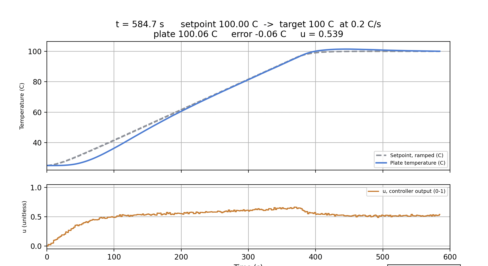

# Thermal PID Simulation

## What I want

I wanted to build a simulation that sets the aluminium plate I have to a given
temperature and holds it steady there. A system I can observe, and whose setpoint I can
change.

## What I get

I got a simulation where I can set the plate to a given temperature with a PID
controller. Inside it I can change kp, ki, kd and i_max, which I used to tune the a/b/c
values. I can also change the setpoint: because it rises along a fixed slope, that slope
acts as built-in protection against overshoot.

## How it works

The sensor first reads the plant's current temperature, which starts at the ambient room
temperature. Then the PID computes the error. The error passes through the proportional,
integral and derivative terms; their sum is the output value. If that value is above 1 it
is clipped to 1, because the heater cannot run at more power than it has.

This output is multiplied by our supply voltage, 24 V, giving the input power we want.
The current heats the wire, then heat is exchanged between the wire and the plant. The
plant warms up and the sensor reports the new temperature back to the PID. The loop
repeats until the plate reaches the temperature we set. After that, the energy we feed in
equals the energy lost, so it stays around that point with very small oscillations.

### Setpoint change

When the system is at steady state, raising the setpoint all at once created an
overshoot risk. As a solution we raise the setpoint along a fixed slope, so our
integral value does not swell up for nothing and we get ahead of the windup problem.

## Values

| Variable | Value | Unit | Meaning |
|---|---|---|---|
| kp | 0.04175 | 1/K | proportional gain |
| ki | 0.0006 | 1/(K*s) | integral gain |
| kd | 0.6486 | s/K | derivative gain |
| dt | 0.1 | s | simulation time step |
| V | 24 | V | supply voltage |
| R_h | 10 | ohm | heater resistance |
| t_env | 25 | degC | ambient temperature |
| h | 10 | W/(m^2*K) | convection coefficient |
| Cp | 900 | J/(kg*K) | specific heat of aluminium |
| m | 0.05 | kg | mass of the aluminium plate |
| m_heater | 0.002 | kg | mass of the heater |
| Cp_heater | 450 | J/(kg*K) | specific heat of the heater |
| plant_area | 0.021 | m^2 | plant surface area |
| K_hp | 1.0 | W/K | heater-to-plant conduction coefficient |
| sensor_noise | 0.05 | degC | sensor noise amplitude |
| tau_d | 5 | s | derivative low-pass time constant |
| dt_ctrl | 2.0 | s | PID loop period |
| sp_rate | 0.2 | degC/s | setpoint ramp rate |
| sp_tau | 20.0 | s | setpoint filter time constant |

## Theory

### What is PID

A feedback-based control mechanism, generally used to drive machines to a desired value
smoothly and hold them there. It is used a lot in industrial systems. It works by running
the variable we call the error through three terms - proportional, integral and
derivative - and summing them into one output. That output is what we use to compute the
power needed to reach the desired value.

### What is a forward-Euler low-pass filter

Our filter takes the difference between the incoming raw value and the previous filtered
value, and adds a fraction dt/tau of that difference to the output. So the output moves
proportionally closer to the true value at every step.

### What is Newton's law of cooling

$$dT/dt = -k(T - T_{env})$$

Newton's law of cooling puts into a mathematical formula how a body cools down or heats
up through its interaction with the environment. Here k is the cooling constant.

### Lumped capacitance model

This model assumes the temperature is the same everywhere in the object at every instant,
with no difference between the centre and the surface. In our code we used it as:

```python
T_heater += (Q / (m_heater * Cp_heater))
```

Instead of accepting that heat varies from the centre outwards, we accepted it as equal
and identical everywhere at the same time.

## Error

Inside the simulation, most of our error sources come from sensor noise and from delay.
Beyond that, our material values and the conduction coefficient of the environment are
estimated and random values, so for now I cannot give a real error percentage.

## Step response


