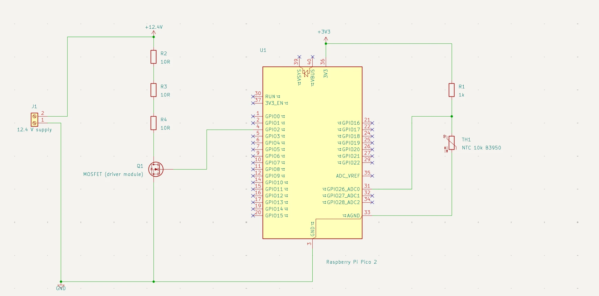
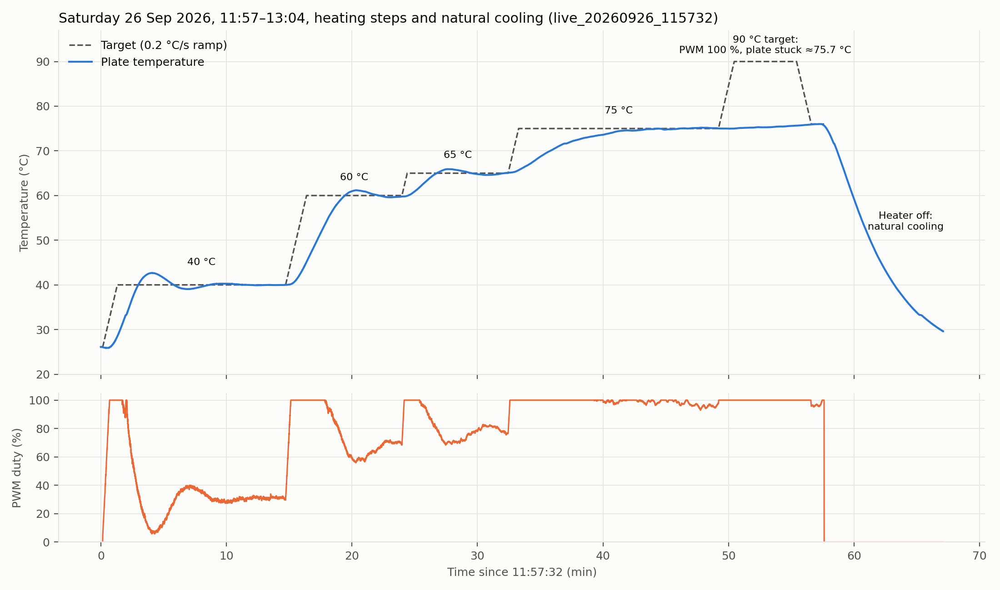
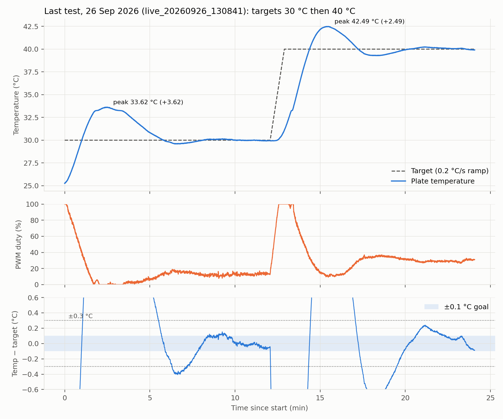

# PID Temperature Controller

## 1. Aim

The aim of this experiment is to learn how a PID controller works and to hold a
plate at a chosen temperature with an error of at most ±0.1 °C.

## 2. Theory

### 2.1 PID control

A PID controller looks at the error, the difference between where I want the
temperature to be and where it is, and turns it into a heater power:

$$u(t) = K_p\,e(t) + K_i \int e(t)\,dt - K_d\,\frac{dT}{dt}$$

- `u` is the heater power as PWM duty (%), `e` is the error (°C), `T` is the
  measured temperature (°C).
- **P** reacts to the error now: a large error gives a large power.
- **I** adds up the error over time: it removes a small error that would
  otherwise stay forever, such as the power needed just to cover heat losses.
- **D** reacts to how fast the temperature changes: it brakes while the plate
  heats up quickly, before the target is passed.

I take the D term from the measurement (`dT/dt`) instead of from the error.
When the target changes, the error jumps, but the measurement does not, so the
power does not spike.

### 2.2 Discrete implementation and filters

The controller runs every Δt = 0.2 s. Each step:

- the integral grows by `Ki · e · Δt`;
- the temperature rate is smoothed with a first-order low-pass filter,
  `r ← r + (r_raw − r) · α` with `α = 1 − e^(−Δt/τd)` and `τd = 3 s`, so a
  noisy single reading cannot make the D term jump;
- the measurement first goes through a **median filter** of the last 5
  readings: the readings are sorted and the middle one is used, so one wrong
  reading is ignored completely.

### 2.3 Anti-windup

When the output is stuck at 0 % or 100 %, the heater cannot do more, but the
integral would keep growing. Later it has to shrink again, and during that time
the temperature overshoots. This is called integral windup. My controller only
updates the integral when the new output stays inside 0–100 %, or when the
update moves the output back inside that range (conditional integration).

### 2.4 Setpoint ramp

Instead of jumping to a new target, the controller moves its internal target
(the setpoint) towards it at 0.2 °C/s. This gives the plate a reachable path
and keeps the integral from filling up during a large jump.

### 2.5 NTC thermistor and the Beta equation

An NTC is a resistor whose resistance falls as the temperature rises. The Beta
equation relates the two:

$$R(T) = R_{25}\, e^{\,B\left(\frac{1}{T} - \frac{1}{T_{25}}\right)}
\qquad\Longrightarrow\qquad
T = \frac{1}{\frac{1}{T_{25}} + \frac{\ln(R/R_{25})}{B}}$$

with `R25 = 10 kΩ`, `T25 = 298.15 K` and `B = 3950 K`. The NTC and a fixed
`1 kΩ` resistor form a voltage divider. The ADC reads the middle point as a
fraction `x` of full scale, and the NTC resistance is
`R = 1 kΩ · x / (1 − x)`.

### 2.6 Thermal model (Newton's law of cooling)

The plate stores heat and loses it to the room. A first-order heat balance
describes this:

$$C\,\frac{dT}{dt} = P - \frac{T - T_{room}}{R_{th}}$$

- `P` is the heater power (W), `C` the heat capacity (J/°C), `R_th` the thermal
  resistance to the room (°C/W): how many degrees above the room the plate
  stays for every watt it receives.
- **Steady state** (`dT/dt = 0`): `T = T_room + P · R_th`. The maximum
  temperature is therefore `T_room + P_max · R_th`.
- **Cooling** with the heater off: `T(t) = T_room + (T0 − T_room) · e^(−t/τ)`
  with time constant `τ = R_th · C`.

### 2.7 PWM power

The MOSFET switches the full supply voltage on and off. The average heater power
is `P = duty · V² / R`.

### 2.8 Relay autotune and Ziegler–Nichols

In a relay test the heater power switches between `bias + d` and `bias − d`
each time the temperature crosses the target. The plate then oscillates by
itself. From the oscillation:

- `Tu` is the oscillation period;
- `Ku = 4d / (π a)` is the ultimate gain, with `a` the oscillation amplitude.

The classic Ziegler–Nichols rules turn these into PID gains:

$$K_p = 0.6\,K_u \qquad K_i = \frac{2K_p}{T_u} \qquad K_d = \frac{K_p\,T_u}{8}$$

## 3. Setup

Parts I used:

| Part | Details |
|---|---|
| Heater | 3 × 10 Ω cement resistors in series (30 Ω), 12.4 V supply |
| Temperature sensor | NTC 10 kΩ at 25 °C, B25/50 = 3950 K, steel sheath, epoxy sealed, 100 cm cable |
| Divider resistor | 1 kΩ fixed resistor |
| Switch | MOSFET, 1 kHz PWM |
| Microcontroller | Raspberry Pi Pico 2 running CircuitPython |

### 3.1 Heater

The microcontroller sends a PWM signal to the MOSFET. The MOSFET switches on and
off with this signal and passes the 12.4 V from the power supply to the heater.
The higher the PWM duty, the longer the heater is on and the hotter the plate
gets.

I use three resistors for this reason. I first characterized the system with a
single 10 Ω resistor, and at only 15 % PWM the plate already reached 99.7 °C.
That meant I was controlling the whole 0–100 °C range with only 0–15 % of the
PWM range. To spread it wider, I connected two more resistors in series. This
cut the heater power to one third.

With 30 Ω in series the current is 12.4 / 30 = 0.41 A, and the power at 100 %
PWM is 12.4² / 30 = 5.13 W. Each resistor dissipates at most 1.71 W.

### 3.2 Temperature measurement

The NTC sits on the ground side of the divider and the 1 kΩ resistor on the
supply side. The
Pico's ADC (GP26) reads the middle point. To reduce noise, every reading is the
average of 1024 ADC samples. The Beta equation (section 2.5) then converts the
resistance to temperature. The NTC is attached to the plate.

### 3.3 Board and power switching

The Pico 2 produces a 1 kHz PWM signal on GP2, which drives the MOSFET gate.
The Pico is connected to my computer over USB. It takes a reading every 0.2 s
and sends it to the computer, where a logging script (`tools/live_pid.py`) saves it.

### 3.4 Schematic

**Figure 1.** Circuit schematic drawn in KiCad (`kicad/pid_heater.kicad_sch`).
J1 is the 12.4 V supply input, R2–R4 are the heater resistors, Q1 is the MOSFET
on the driver module, U1 is the Raspberry Pi Pico 2, and R1 with TH1 form the
NTC divider read by ADC0 (GP26).

## 4. Method

### 4.1 System characterization

First I turned the controller off, ran the heater at a fixed PWM and watched
where the temperature settled. This showed me how hot the plate gets at a
given power and how slowly it heats. On 14 September, with a single 10 Ω
resistor, I used 5 %, then 10 %, then 15 %, then 0 %:

| PWM change | Time (s) | Temperature at change (°C) |
|---|---:|---:|
| 0 → 5 % | 24.2 | 25.66 |
| 5 → 10 % | 986.5 | 49.93 |
| 10 → 15 % | 3389.8 | 76.03 |
| 15 → 0 % | 5434.7 | 98.77 |

At 15 % the plate reached 99.68 °C. After this test I switched to three
resistors in series and ran the heater at 100 % PWM on 15 September
(`data/2026-09-15_fixed_duty_3x10R/1503_100pct_then_off.csv`). Starting from 23.2 °C, the plate reached
108.8 °C after 48 minutes and was then almost steady (still rising by
0.08 °C/min). With 5.13 W this gives a thermal resistance of about
(108.8 − 23.2) / 5.13 ≈ 16.7 °C/W. On Saturday the PID tests gave a different
value (sections 5.3 and 6.1).

### 4.2 Finding the PID gains

I first tried to tune the gains by hand, but the system never settled
properly, so I switched to a relay test. I used a relay autotune in the style
of the one in the Marlin 3D-printer firmware, run with my own script
(`tools/relay_autotune.py`). It was run on 15 September at a target of 70 °C:

- when the temperature rose 0.25 °C above 70 °C, the power dropped to
  `bias − 15 %`; when it fell 0.25 °C below, the power rose to `bias + 15 %`;
- the script adjusted the bias by itself between cycles (46–57 %, about
  35 % ↔ 65 % power);
- after 7 cycles it gave `Tu = 177.8 s` and `Ku = 22.2 %/°C`.

With the Ziegler–Nichols rules (section 2.8):

| Gain | Formula | Value |
|---|---|---|
| Kp | 0.6 × Ku | 13.32 %/°C |
| Ki | 2 × Kp / Tu | 0.1498 %/(°C·s) |
| Kd | Kp × Tu / 8 | 296 %·s/°C |

### 4.3 Controller

The controller (`firmware/code.py`) runs every 0.2 s:

1. The reading goes through the 5-sample median filter.
2. The internal setpoint moves towards the target at 0.2 °C/s.
3. P uses the error to the setpoint, I the accumulated error, D the filtered
   temperature rate (3 s filter), as in section 2.
4. The integral is only updated when that does not push the output past
   0–100 % (anti-windup), and it is limited to 0–100 %.
5. The output is limited to 0–100 % and sent to the MOSFET as PWM.
6. If a reading is below −20 °C or above 160 °C, the heater turns off.

## 5. Results

### 5.1 Full session

**Figure 2.** Saturday 11:57–13:04 (log `1157`). I set the target
to 40, 60, 65, 75 and 90 °C in turn. At 90 °C the PWM stayed at 100 %, but the
plate could not go above 75.7 °C. Then I turned the heater off and the plate
cooled from 75.6 °C to 30 °C in 9.3 minutes.

### 5.2 Step results

I judge each step with these measures:

- **Overshoot:** highest temperature reached minus the target.
- **Settling time:** time from the start of the step until the temperature
  enters ±0.3 °C of the target and never leaves again.
- **Time within ±0.1 °C:** share of the time after settling that the
  temperature stayed within ±0.1 °C of the target.
- **Required PWM:** mean PWM over the last 2 minutes of the step.

The Log column gives the start time (hhmm) of the log file in
`data/2026-09-26_pid_tests/`.

| Target (start) | Log | Overshoot | Settling time | Time within ±0.1 °C | Required PWM |
|---|---|---:|---:|---:|---:|
| 30 °C (25.3) * | 1308 | +3.62 °C | 433 s | 76 % | 13.0 % |
| 35 °C (29.6) | 1008 | +2.84 °C | 415 s | 46 % | 25.7 % |
| 40 °C (28.5) | 1157 | +2.68 °C | 413 s | 63 % | 31.1 % |
| 40 °C (31.1) | 1308 | +2.49 °C | 396 s | 54 % | 29.4 % |
| 60 °C (45.2) | 1157 | +1.19 °C | 437 s | – (settled only 19 s before the next step) | 69.5 % |
| 65 °C (59.9) | 1157 | +0.91 °C | 420 s | 48 % | 80.1 % |
| 75 °C (65.7) | 1157 | +0.20 °C | 591 s | 41 % | 95.8 % |

After settling, the temperature stayed within ±0.3 °C of the target. The
standard deviation of the error was 0.10–0.13 °C.

\* This step started without the ramp (the target was already 30 °C) and at
100 % PWM, so its overshoot is not directly comparable with the other steps.

### 5.3 Power needed for each target

**Figure 3.** Required PWM against target temperature.

The points lie almost on a straight line:
`PWM = 1.855 × T − 42.21` (R² = 0.997).

- Every 1 % of PWM keeps the plate about 0.54 °C warmer.
- The line reaches 0 % at 22.8 °C, which is the room temperature.
- At 100 % PWM the highest reachable temperature is about **76.7 °C**.

With 1 % PWM = 0.0513 W, this gives a thermal resistance of
`R_th = 0.539 / 0.0513 ≈ 10.5 °C/W` (section 2.6), assuming the full
12.4 V reached the heater.

### 5.4 Natural cooling

After the heater turned off at 75.6 °C, the plate reached 30.0 °C after 9.3
minutes. Fitting the cooling curve of section 2.6 (from 60 s after switch-off)
gives a time constant of about 290 s (4.8 min), with an RMS fit error of
0.30 °C. With `R_th ≈ 10.5 °C/W`, the heat capacity is roughly
`C = τ / R_th ≈ 28 J/°C`. The fit puts the room at 20.6 °C, lower than the
22.8 °C of section 5.3, so the single-time-constant model is only an
approximation here.

## 6. Problems and limits

### 6.1 The 76 °C ceiling

At the 90 °C target the PWM stayed at 100 % and the plate reached only
75.65 °C. Holding 80 °C would need 5.44 W (106 % PWM) and
90 °C would need 6.39 W (125 %), which this heater cannot deliver. During the
5 minutes at the 90 °C target the plate was still rising slowly, from 74.99 °C
to 75.65 °C, so it had not yet reached the 76.7 °C ceiling of section 5.3.

The three-resistor heater itself was strong enough: on 15 September the same
heater reached 108.8 °C at 100 % PWM (section 4.1). The thermal resistance
changed from day to day:

| Date | Heater | Thermal resistance | Highest temperature measured |
|---|---|---:|---:|
| 14 September | 1 × 10 Ω | about 32 °C/W | 99.7 °C at 15 % PWM |
| 15 September | 3 × 10 Ω | about 16.7 °C/W | 108.8 °C at 100 % PWM |
| 26 September | 3 × 10 Ω | about 10.5 °C/W | 75.65 °C at 100 % PWM |

So on Saturday either less power reached the heater, or the plate lost heat
about 1.6 times more easily than on 15 September (section 6.2).

### 6.2 Room temperature

On the day I tuned the gains the room was about 29 °C. On Saturday it was
cooler: about 10 °C by my estimate, while the power line in section 5.3 points
to 22.8 °C, about 6 °C lower. The ceiling moves one-to-one with the room
temperature, so a colder room lowers it by the same number of degrees. But even
with a 29 °C room the ceiling would be only about 83 °C, so the room temperature
is not the main reason. The main reason is that on Saturday the heater's power was too small for the
plate's heat losses (section 6.1).

The room temperature also does not explain why the plate needed more power on
Saturday. During the relay test on 15 September, holding 70 °C took about 50 %
PWM. On Saturday the power line gives about 88 % for 70 °C. A 6 °C colder room
accounts for only about 15 % more power, not 76 %, so something else in the setup also changed between the two days. The same
heater reached 108.8 °C at full power on 15 September but only about 76 °C on
Saturday. Either less power reached the heater (for example a lower voltage) or
the resistors sat differently on the plate. I could not check this.

## 7. Error analysis

There are two kinds of error:

- **Control error:** how far the measured temperature is from the target.
  This is covered in section 5.2.
- **Measurement error:** how far the measured temperature is from the true
  plate temperature. This is covered here.

The NTC's R25 tolerance is ±1 % and its B tolerance is ±1 % (datasheet). I
assumed ±1 % for the 1 kΩ resistor; with a ±5 % resistor its row
in the table would be five times larger. All values are in °C and were calculated from these
tolerances, except the noise, which was measured from the logs.

| Error source | 30 °C | 40 °C | 60 °C | 75 °C |
|---|---:|---:|---:|---:|
| NTC R25 ±1 % | ±0.23 | ±0.25 | ±0.28 | ±0.31 |
| NTC B ±1 % | ±0.05 | ±0.16 | ±0.39 | ±0.59 |
| 1 kΩ resistor ±1 % (assumed) | ±0.23 | ±0.25 | ±0.28 | ±0.31 |
| **Combined (root sum of squares)** | **±0.33** | **±0.38** | **±0.56** | **±0.73** |
| Worst case (all in the same direction) | ±0.51 | ±0.65 | ±0.95 | ±1.20 |
| One 12-bit ADC step | 0.058 | 0.045 | 0.034 | 0.031 |
| Reading noise (measured) | – | 0.0027 | – | 0.0012 |

What this means:

- The tolerance errors are fixed offsets. They do not change over time, so they
  do not affect how steady the temperature is. They only affect whether the
  plate is truly at, for example, 40.0 °C.
- The reading noise is 40–80 times smaller than 0.1 °C. The 0.10–0.13 °C
  spread after settling is therefore a real change of the reading, not
  sensor noise.
- The reading noise is also smaller than one ADC step. This is because every
  reading is the average of 1024 ADC samples, which gives much finer steps
  than a single sample.
- My ±0.1 °C goal can only be judged against the sensor reading. The true
  plate temperature is known to about ±0.4 °C at 40 °C.

Not included:

- **Self-heating of the NTC:** assuming a 3.3 V divider, the NTC dissipates
  1.1 mW at 30 °C and 2.6 mW at 75 °C. The datasheet gives no dissipation
  constant, so the resulting temperature rise is unknown.
- **ADC offset and gain errors** of the Pico.
- **Contact between the NTC and the plate.**

These can only be measured by comparing against a reference thermometer.

## 8. Evaluation

For the evaluation I used the last test on Saturday (log `1308`, Figure 4): first
30 °C, then 40 °C.

**Figure 4.** Last test: temperature and target, PWM, and the error with the
±0.1 °C band.

| | 30 °C * | 40 °C |
|---|---:|---:|
| Overshoot | +3.62 °C | +2.49 °C |
| Settling time | 433 s | 396 s |
| Time within ±0.1 °C after settling | 76 % | 54 % |
| Largest error after settling | 0.29 °C | 0.30 °C |
| Required PWM | 13.0 % | 29.4 % |

\* Started without the ramp and at 100 % PWM (see section 5.2).

My goal was ±0.1 °C. After settling the temperature stayed within ±0.3 °C, but
not always within ±0.1 °C, so I did not fully reach the goal. In the
clean 40 °C step the temperature first passed the target by 2.49 °C, and both
steps took about 7 minutes to settle. In the higher steps on the same day the overshoot was smaller (+0.20 °C at
75 °C). A likely reason is that I found the gains at 70 °C on 15 September, when the
setup behaved differently (section 6.2).

## 9. Possible improvements

I could not run more tests within this work. If the experiment were continued,
these changes would address the problems above:

1. Measure the voltage across the heater at 100 % PWM, to check whether the
   full 12.4 V reaches it.
2. Repeat the relay test with the current heater and at a lower temperature,
   to reduce the overshoot at 30–40 °C.
3. If the plate keeps losing heat as on Saturday, connect two resistors in series
   instead of three (20 Ω, 7.7 W) to raise the ceiling to roughly 100 °C.
4. Compare the NTC with a reference thermometer and fix it to the plate more
   firmly, to measure the errors listed in section 7.
5. Log the room temperature with every test.

## Appendix

### A. Data files

- `data/2026-09-26_pid_tests/`: the three Saturday PID logs (`1008`, `1157`, `1308`)
- `data/2026-09-15_relay_autotune/`: relay test log and result
- `data/2026-09-15_fixed_duty_3x10R/`: fixed-PWM test with three resistors
- `data/2026-09-14_fixed_duty_1x10R/`: fixed-PWM test with one resistor
- `notes/2026-09-14_fixed_duty_findings.md`: notes on the one-resistor test

### B. Code

- `firmware/code.py`: controller running on the Pico 2 (copied to the board as `code.py`)
- `firmware/classic_pid.py`: the same controller as a module, used by the tests
- `firmware/fixed_duty_code.py`: firmware for the fixed-PWM test
- `tools/live_pid.py`: live plot and logger on the computer
- `tools/relay_autotune.py`: relay autotune
- `tools/fixed_duty_live.py`, `tools/fit_fixed_duty.py`: fixed-PWM logger and model fit
- `kicad/pid_heater.kicad_pro`, `kicad/pid_heater.kicad_sch`: KiCad schematic
- `tests/`: unit tests

### C. Calculations

- Heater current: `I = V / R = 12.4 / 30 = 0.413 A`
- Heater power at 100 %: `P = V² / R = 12.4² / 30 = 5.13 W`, so 1 % PWM = 0.0513 W
- Thermal resistance: `R_th = 0.539 °C/% ÷ 0.0513 W/% ≈ 10.5 °C/W`
- Ceiling: `T_max = 22.8 + 5.13 × 10.5 ≈ 76.7 °C`
- Heat capacity: `C = τ / R_th ≈ 290 / 10.5 ≈ 28 J/°C`
