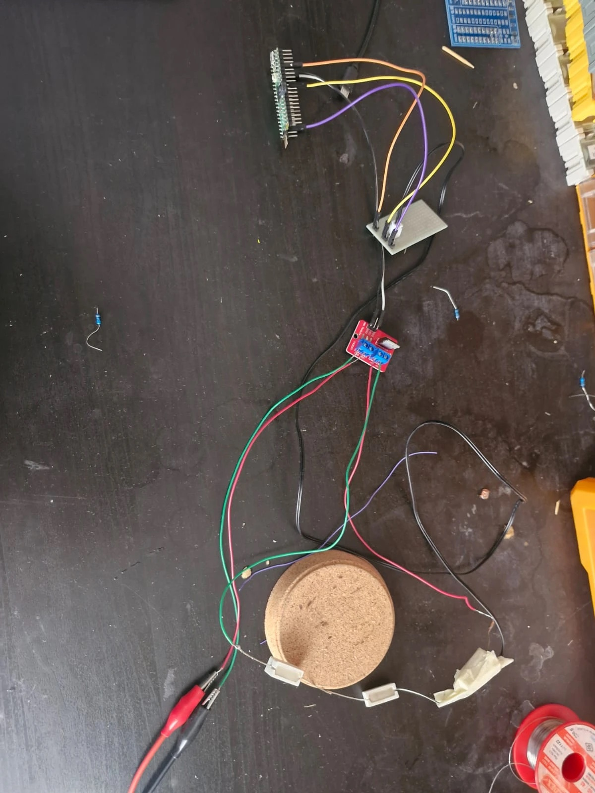
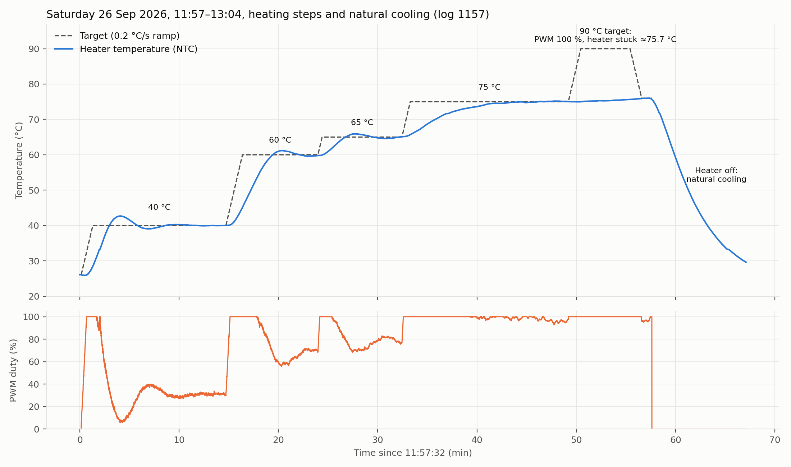
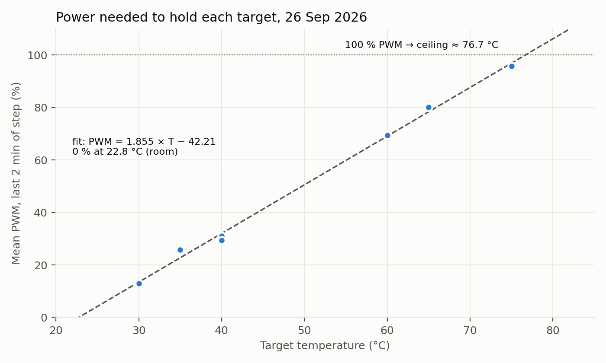
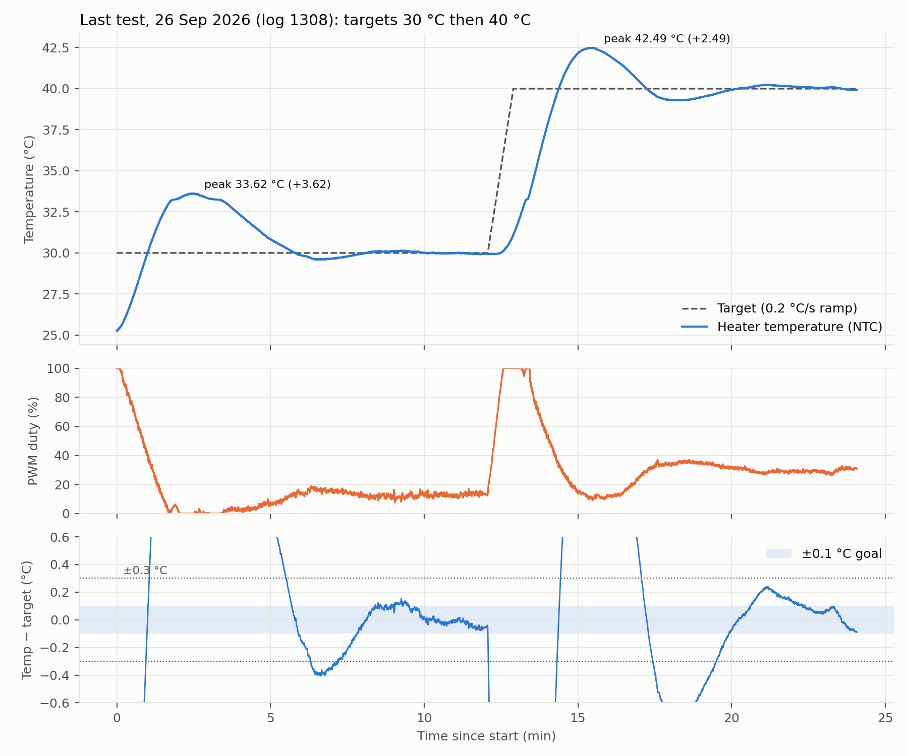

# PID Temperature Controller

## 1. Aim

In this experiment I wanted to learn how a PID controller works and use one to
hold a heater at a set temperature with an error of at most ±0.1 °C. The heater
is three resistors in series, and an NTC taped to one of them measures the
temperature.

## 2. Theory

### 2.1 PID control

A PID controller looks at the error, the difference between where I want the
temperature to be and where it is, and turns it into a heater power:

$$u(t) = K_p\,e(t) + K_i \int e(t)\,dt - K_d\,\frac{dT}{dt}$$

- `u` is the heater power as PWM duty (%), `e` is the error (°C), `T` is the
  measured temperature (°C).
- **P** reacts to the error now: a large error gives a large power.
- **I** adds up the error over time: it removes a small error that would
  otherwise stay forever, such as the power needed just to cover heat losses.
- **D** reacts to how fast the temperature changes: it brakes while the heater
  heats up quickly, before the target is passed.

I take the D term from the measurement (`dT/dt`) instead of from the error.
When the target changes, the error jumps, but the measurement does not, so the
power does not spike.

### 2.2 Discrete implementation and filters

The controller runs every Δt = 0.2 s. Each step:

- the integral grows by `Ki · e · Δt`;
- the temperature rate is smoothed with a first-order low-pass filter,
  `r ← r + (r_raw − r) · α` with `α = 1 − e^(−Δt/τd)` and `τd = 3 s`, so a
  noisy single reading cannot make the D term jump;
- the measurement first goes through a **median filter** of the last 5
  readings: the readings are sorted and the middle one is used, so one wrong
  reading is ignored completely.

### 2.3 Anti-windup

When the output is stuck at 0 % or 100 %, the heater cannot do more, but the
integral would keep growing. Later it has to shrink again, and during that time
the temperature overshoots. This is called integral windup. My controller only
updates the integral when the new output stays inside 0–100 %, or when the
update moves the output back inside that range. This is conditional integration.

### 2.4 Setpoint ramp

Instead of jumping to a new target, the controller moves its internal target,
called the setpoint, towards it at 0.2 °C/s. This gives the heater a reachable
path and keeps the integral from filling up during a large jump.

### 2.5 NTC thermistor and the Beta equation

An NTC is a resistor whose resistance falls as the temperature rises. The Beta
equation relates the two:

$$R(T) = R_{25}\, e^{\,B\left(\frac{1}{T} - \frac{1}{T_{25}}\right)}
\qquad\Longrightarrow\qquad
T = \frac{1}{\frac{1}{T_{25}} + \frac{\ln(R/R_{25})}{B}}$$

with `R25 = 10 kΩ`, `T25 = 298.15 K` and `B = 3950 K`. The NTC and a fixed
`1 kΩ` resistor form a voltage divider. The ADC reads the middle point as a
fraction `x` of full scale, and the NTC resistance is
`R = 1 kΩ · x / (1 − x)`.

### 2.6 Thermal model and Newton's law of cooling

The heater stores heat and loses it to the room. A first-order heat balance
describes this:

$$C\,\frac{dT}{dt} = P - \frac{T - T_{room}}{R_{th}}$$

- `P` is the heater power (W), `C` the heat capacity (J/°C), `R_th` the thermal
  resistance to the room (°C/W): how many degrees above the room the heater
  stays for every watt it receives.
- **Steady state** (`dT/dt = 0`): `T = T_room + P · R_th`. The maximum
  temperature is therefore `T_room + P_max · R_th`.
- **Cooling** with the heater off: `T(t) = T_room + (T0 − T_room) · e^(−t/τ)`
  with time constant `τ = R_th · C`.

### 2.7 PWM power

The MOSFET switches the full supply voltage on and off. The average heater power
is `P = duty · V² / R`.

### 2.8 Relay autotune and Ziegler–Nichols

In a relay test the heater power switches between `bias + d` and `bias − d`
each time the temperature crosses the target. The temperature then oscillates
by itself. From the oscillation:

- `Tu` is the oscillation period;
- `Ku = 4d / (π a)` is the ultimate gain, with `a` the oscillation amplitude.

The classic Ziegler–Nichols rules turn these into PID gains:

$$K_p = 0.6\,K_u \qquad K_i = \frac{2K_p}{T_u} \qquad K_d = \frac{K_p\,T_u}{8}$$

## 3. Setup

| Part | Details |
|---|---|
| Heater | 3 x 10 Ω cement resistors in series, giving 30 Ω total; 12.4 V supply |
| Temperature sensor | NTC, 10 kΩ at 25 °C, B25/50 = 3950 K, steel sheath, epoxy sealed, 100 cm cable |
| Divider resistor | 1 kΩ fixed resistor |
| Switch | MOSFET on a driver module, 1 kHz PWM |
| Microcontroller | Raspberry Pi Pico 2 running CircuitPython |

### 3.1 Heater

The Pico sends a PWM signal to the MOSFET, and the MOSFET switches the 12.4 V
from the power supply on and off across the heater. A higher duty keeps the
heater on for longer, so it gets hotter.

I ended up with three resistors because of the first characterization. With a
single 10 Ω resistor the heater already reached 99.7 °C at 15 % PWM, so the
whole 0 to 100 °C range sat in the first 15 % of the PWM range. I added two
more resistors in series to spread it out, which cut the heater power to a
third.

With 30 Ω the current is 12.4 / 30 = 0.41 A and the power at 100 % PWM is
12.4 x 12.4 / 30 = 5.13 W, so each resistor dissipates at most 1.71 W.

### 3.2 Temperature measurement

The NTC is on the ground side of the divider and the 1 kΩ resistor on the
supply side. The Pico's ADC reads the middle point on GP26. Each reading is the
average of 1024 ADC samples to cut the noise. The Beta equation turns the
resistance into a temperature. The NTC is taped to one of the heater resistors,
so every temperature in this report refers to that resistor.

### 3.3 Board and power switching

The Pico 2 makes a 1 kHz PWM signal on GP2 for the MOSFET gate. It is connected
to my computer over USB, takes a reading every 0.2 s and sends it to the
computer, where `tools/live_pid.py` saves it.

### 3.4 Schematic

**Figure 1.** Schematic drawn in KiCad. J1 is the
12.4 V supply input, R2 to R4 are the heater resistors, Q1 is the MOSFET on the
driver module, U1 is the Pico 2, and R1 and TH1 form the NTC divider read on
GP26, the ADC0 input.

### 3.5 Photo of the setup

**Figure 2.** The setup on the bench. At the top is the Pico 2. In the middle
are the small perfboard with the NTC divider and the red MOSFET driver module.
At the bottom are the three cement resistors around a cork base, with the NTC
taped to the right one, and the red and black clips from the 12.4 V supply.

## 4. Method

### 4.1 System characterization

Before using the controller I ran the heater at fixed PWM values to see how hot
it gets at a given power and how slowly it heats up. On 14 September, still
with one 10 Ω resistor, I used 5 %, 10 % and 15 %, and then switched it off:

| PWM change | Time (s) | Temperature at the change (°C) |
|---|---:|---:|
| 0 to 5 % | 24.2 | 25.66 |
| 5 to 10 % | 986.5 | 49.93 |
| 10 to 15 % | 3389.8 | 76.03 |
| 15 to 0 % | 5434.7 | 98.77 |

At 15 % the resistor reached 99.68 °C. After that I changed to three resistors
and on 15 September ran them at 100 % PWM. The heater
started at 23.2 °C and reached 108.8 °C after 48 minutes. At that point it was
almost steady, still rising by 0.08 °C/min. With 5.13 W this gives a thermal
resistance of (108.8 - 23.2) / 5.13 = 16.7 °C/W. The Saturday tests gave a
different value.

### 4.2 Finding the PID gains

I first tried to tune the gains by hand, but the temperature never settled
properly, so I switched to a relay test. I ran it on 15 September with a target
of 70 °C. When the temperature went 0.25 °C above the target, the power dropped
to bias - 15 %. When it went 0.25 °C below, the power rose to bias + 15 %.
The script adjusted the bias between cycles on its own, between 46 and 57 %,
so the power swung
between roughly 35 and 65 %. After 7 cycles it gave Tu = 177.8 s and
Ku = 22.2 %/°C, and the Ziegler-Nichols rules turned these
into the gains:

| Gain | Formula | Value |
|---|---|---|
| Kp | 0.6 x Ku | 13.32 %/°C |
| Ki | 2 x Kp / Tu | 0.1498 %/(°C s) |
| Kd | Kp x Tu / 8 | 296 % s/°C |

### 4.3 Controller

The controller runs every 0.2 s. Each reading first goes
through the 5-sample median filter, and the internal setpoint moves toward the
target at 0.2 °C/s. P works on the error to the setpoint, I on the accumulated
error and D on the temperature rate after a 3 s filter. The integral is kept
between 0 and 100 %, and it is not updated when that would push the output past
0 or 100 %. This prevents integral windup. The output is limited
to 0 to 100 % and goes to the MOSFET as PWM. If a reading is below -20 °C or
above 160 °C, the heater turns off.

## 5. Results

### 5.1 Full session

**Figure 3.** Saturday 11:57 to 13:04, recorded in log `1157`. I set the target
to 40, 60, 65, 75 and 90 °C one after another. At 90 °C the PWM stayed at
100 % but the heater did not go above 75.7 °C. Then I turned it off, and it cooled from
75.6 °C to 30 °C in 9.3 minutes.

### 5.2 Step results

For each step I looked at four things. Overshoot is the highest temperature
minus the target. Settling time is the time from the start of the step until
the temperature is within ±0.3 °C of the target and stays there. Time within
±0.1 °C is the share of the time after settling that it stayed inside ±0.1 °C.
Required PWM is the mean PWM over the last 2 minutes of the step. The Log column
identifies each file by its four-digit start time.

| Target °C | Start °C | Log | Overshoot | Settling time | Time within ±0.1 °C | Required PWM |
|---:|---:|---|---:|---:|---:|---:|
| 30 * | 25.3 | 1308 | +3.62 °C | 433 s | 76 % | 13.0 % |
| 35 | 29.6 | 1008 | +2.84 °C | 415 s | 46 % | 25.7 % |
| 40 | 28.5 | 1157 | +2.68 °C | 413 s | 63 % | 31.1 % |
| 40 | 31.1 | 1308 | +2.49 °C | 396 s | 54 % | 29.4 % |
| 65 | 59.9 | 1157 | +0.91 °C | 420 s | 48 % | 80.1 % |
| 75 | 65.7 | 1157 | +0.20 °C | 591 s | 41 % | 95.8 % |

After settling the temperature stayed within ±0.3 °C, and the standard
deviation of the error was 0.10 to 0.13 °C.

\* This step started without a ramp because the target was already 30 °C. PWM
was at 100 %, so its overshoot is not directly comparable with the other steps.

### 5.3 Power needed for each target

**Figure 4.** Required PWM against target temperature.

The points lie close to a straight line: PWM = 1.855 x T - 42.21. The fit has
R² = 0.997.
Each 1 % of PWM keeps the heater about 0.54 °C warmer. The line reaches 0 % at
22.8 °C, which is the room temperature, and at 100 % PWM it gives a highest
reachable temperature of 76.7 °C. Since 1 % PWM is 0.0513 W, the thermal
resistance is 0.539 / 0.0513 = 10.5 °C/W if the full 12.4 V
reached the heater.

### 5.4 Natural cooling

After I switched the heater off at 75.6 °C it took 9.3 minutes to get down to
30.0 °C. I fitted the cooling curve to the data from 60 s after switch-off.
The time constant came out at 290 s, or 4.8 min, with an RMS error of
0.30 °C, and with R_th = 10.5 °C/W that gives a heat capacity of roughly
28 J/°C. The fit puts the room at 20.6 °C instead of 22.8 °C, so a single time
constant describes the cooling only approximately.

## 6. Problems and limits

### 6.1 The 76 °C ceiling

At the 90 °C target the PWM stayed at 100 % and the heater reached 75.65 °C. It
was still creeping up, from 74.99 to 75.65 °C in 5 minutes, so it had not yet
reached the estimated 76.7 °C ceiling. Holding 80 °C would need 5.44 W, or
106 % PWM. Holding 90 °C would need 6.39 W, or 125 % PWM. This heater cannot
provide either level of power.

On another day the heater was strong enough, though. On 15 September the same
three resistors reached 108.8 °C at 100 % PWM. The thermal
resistance I got was different each day:

| Date | Heater | Thermal resistance | Highest temperature measured |
|---|---|---:|---:|
| 14 September | 1 x 10 Ω | 32 °C/W | 99.7 °C at 15 % PWM |
| 15 September | 3 x 10 Ω | 16.7 °C/W | 108.8 °C at 100 % PWM |
| 26 September | 3 x 10 Ω | 10.5 °C/W | 75.65 °C at 100 % PWM |

So on Saturday either less power reached the heater, or it lost heat about 1.6
times more easily than on 15 September.

### 6.2 Room temperature

On the day I tuned the gains the room was around 29 °C. I think Saturday was
about 10 °C cooler, and the fitted power line points to 22.8 °C, which is
6 °C lower. The ceiling moves one-to-one with the room temperature, so a colder
room lowers it by the same amount. Even with a 29 °C room the ceiling would have
been 83 °C, though, so the room is not the main reason. The main reason is that
on Saturday the heater's power was too small for its heat losses.

The room also does not explain why the heater needed more power on Saturday.
During the relay test on 15 September, holding 70 °C took around 50 % PWM, while
on Saturday the power line gives 88 % for 70 °C. A 6 °C colder room would
explain 15 % more power, not 76 %. 

## 7. Error analysis

The results above describe control error, meaning how far the measured
temperature is from the target. Measurement error describes how far the
measured temperature is from the real temperature of the resistor.

The NTC's R25 and B tolerances are both ±1 %. For the 1 kΩ resistor I
assumed ±1 %.

| Error source | 30 °C | 40 °C | 60 °C | 75 °C |
|---|---:|---:|---:|---:|
| NTC R25 ±1 % | ±0.23 | ±0.25 | ±0.28 | ±0.31 |
| NTC B ±1 % | ±0.05 | ±0.16 | ±0.39 | ±0.59 |
| 1 kΩ resistor, assumed ±1 % | ±0.23 | ±0.25 | ±0.28 | ±0.31 |
| Combined by root sum of squares | ±0.33 | ±0.38 | ±0.56 | ±0.73 |
| Worst case, with errors in the same direction | ±0.51 | ±0.65 | ±0.95 | ±1.20 |
| One 12-bit ADC step | 0.058 | 0.045 | 0.034 | 0.031 |

The tolerance errors are fixed offsets that do not change over time, so they do
not affect how steady the temperature is. They only matter for whether the
resistor is really at, say, 40.0 °C. This also means my ±0.1 °C goal can only
be judged against the sensor reading. The true temperature of the resistor is
known to about ±0.4 °C at 40 °C.

## 8. Evaluation

For the evaluation I used the last test on Saturday, recorded in log `1308`,
first at 30 °C and then at 40 °C.

**Figure 5.** Last test: temperature and target, PWM, and the error with the
±0.1 °C band.

| | 30 °C * | 40 °C |
|---|---:|---:|
| Overshoot | +3.62 °C | +2.49 °C |
| Settling time | 433 s | 396 s |
| Time within ±0.1 °C after settling | 76 % | 54 % |
| Largest error after settling | 0.29 °C | 0.30 °C |
| Required PWM | 13.0 % | 29.4 % |

\* The 30 °C step began without a ramp at 100 % PWM.

My goal was ±0.1 °C. After settling the temperature stayed within ±0.3 °C but
not always within ±0.1 °C, so I did not fully reach it. In the 40 °C step,
which started normally with the ramp, the temperature first went 2.49 °C past
the target, and both steps took about 7 minutes to settle. The higher steps on
the same day overshot less, with only +0.20 °C at 75 °C. I think the reason is
that I found the gains at 70 °C on 15 September, when the setup behaved
differently.

## 9. Conclusion

I built a PID controller for a small resistor heater and tuned it with a relay
test. After settling it held the temperature within ±0.3 °C, but not within my
±0.1 °C goal: it stayed inside ±0.1 °C for 41 to 76 % of the time. Overshoot
was 0.20 °C at 75 °C and 2.5 to 3.6 °C at 30 to 40 °C, and settling
took 7 to 10 minutes. On Saturday the heater could not go above about 76 °C,
while the same heater reached 108.8 °C on 15 September, so the setup changed
between those two days.

## Appendix

### A. Data files

- `data/2026-09-26_pid_tests/`: the three Saturday PID logs starting at 10:08, 11:57 and 13:08
- `data/2026-09-15_relay_autotune/`: relay test log and result
- `data/2026-09-15_fixed_duty_3x10R/`: fixed-PWM test with three resistors

### B. Code

- `firmware/code.py`: controller running on the Pico 2, copied to the board as `code.py`
  - `tools/live_pid.py`: live plot and logger on the computer
- `kicad/pid_heater.kicad_pro`, `kicad/pid_heater.kicad_sch`: KiCad schematic
